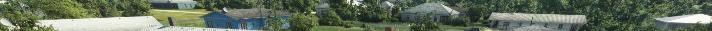
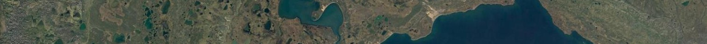
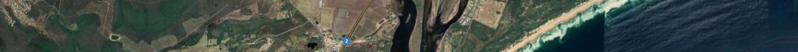
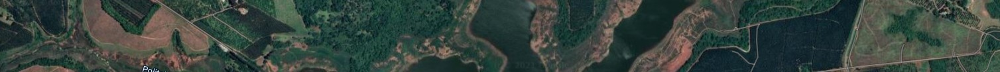

# Flight Simulator 2020 Modding Guide

References:

- This YouTube [playlist](https://www.youtube.com/playlist?list=PL_Up4sAmkCfXIOqIRzS9OpQEJRyW-rnoq)
- [MSFS Custom Airports Guide](./MSFS_custom_airports_v0.3.pdf)
- [Getting started with the SDK / Dev Mode](https://forums.flightsimulator.com/t/how-to-getting-started-with-the-sdk-dev-mode/123241/108)
- [Guide - How to Create a New Airport](https://forums.flightsimulator.com/t/guide-how-to-create-a-new-airport-version-0-3/166902/2)

---

## Installing the SDK

[*Reference*](https://youtu.be/3K0XhAf0WYw?list=PL_Up4sAmkCfXIOqIRzS9OpQEJRyW-rnoq)

1. Run game.
2. Option > General > Developers
3. Turn Developer Mode on
4. Help > SDK Installer

> Download the SDK installer and run. Install it to a folder outside of the FS2020 folder. Let's call it `MSFS SDK`

---

## Creating a Project (Scenery Project)

[*Reference*](https://youtu.be/3K0XhAf0WYw?list=PL_Up4sAmkCfXIOqIRzS9OpQEJRyW-rnoq)

### Prepare the project

1. Copy the `MSFS SDK/Samples/SimpleScenery` sample project to a new directory.
2. Rename to a custom project name. e.g. `TutorialScenery`
  a. Rename `./SimpleScenery.xml` to `TutorialScenery.xml`
    i. Open the file and rename the `<Package>` file entry.
  a. Rename the `./PackageDefinitions` folder/file.
    i. Open the file and rename every reference to `mycompany-scene`
3. Clear the `./PackageSources/modelLib/` folder
  a. Delete `Light_Sample` folder.
  b. Delete the `SampleMyBox` folder.
  c. Delete all files within `textures` folder, but not the folder itself.
4. Clear the `./PackageSources/scene` folder
  a. Delete the `objects.xml`

### Load the project

Prep game:

1. Load into the world at your desired location.
2. Options > Pause Simulation
3. Camera > Developer Camera

Load project:

1. Tools > Project Editor
2. Project > Open... (Browse to the project `.xml`)
3. Build project
   a. Click project dropdown
   b. View > Inspector
   c. Build package

### Save

- Scenery Editor > Save Scenery
- For Shape Files: Save as `PackageSources/scene/projectNameSHP`
- For Scenery Files: Browse to `PackageSources/scene/projectNameSCN`

### Load Into Game

To double check Community folder location

- Tools > Virtual File System
- Opened Watched Bases and see Community folder path

Build the package

- Build project
  a. Project Editor > click project dropdown
  b. View > Inspector
  c. Build package
- Copy `./Packages/projectName` folder into your Community folder

---

## Editing Scenery

[*Reference*](https://youtu.be/IOhnU_w3Us8?list=PL_Up4sAmkCfXIOqIRzS9OpQEJRyW-rnoq)

### Polygons

**Description**

Various uses:

- Removal existing scenery
- Specifying custom terrain (ground types, water, terraforming)

**Usage**

Either

- Click "myscene" under Project Editor > Load in Editor
- Tools > Scenery Editor

To draw polygons (for exclusion bounds, etc.)

- In Objects view > "Polygon" object type.
- Ctrl + click to draw polygon
- Double-click to finish

Polygon now appears in Scenery Editor

- View > Properties
- Select desired behaviour

---

### Scenery

- *[Reference: Replacing Default Scenery](https://www.youtube.com/watch?v=IOhnU_w3Us8&list=PL_Up4sAmkCfXIOqIRzS9OpQEJRyW-rnoq&index=2)*
- *[Reference: Adding Night Lights with Emissive Textures](https://www.youtube.com/watch?v=IOhnU_w3Us8&list=PL_Up4sAmkCfXIOqIRzS9OpQEJRyW-rnoq&index=4)*
- *[Reference: Adding Vegetation](https://www.youtube.com/watch?v=IOhnU_w3Us8&list=PL_Up4sAmkCfXIOqIRzS9OpQEJRyW-rnoq&index=5)*
- *[Reference: Removing Vegeation](https://www.youtube.com/watch?v=kzPEoRloKH8&list=PL_Up4sAmkCfXIOqIRzS9OpQEJRyW-rnoq&index=6)*
- *[Reference: Terraforming Landscapes](https://www.youtube.com/watch?v=kzPEoRloKH8&list=PL_Up4sAmkCfXIOqIRzS9OpQEJRyW-rnoq&index=7)*
- *[Reference: Overriding Ground Textures](https://www.youtube.com/watch?v=kzPEoRloKH8&list=PL_Up4sAmkCfXIOqIRzS9OpQEJRyW-rnoq&index=14)*

**Description**

- Removal existing scenery
- Specifying custom terrain (ground types, water, terraforming)

**Usage**

- Objects view > select object type
- Select object from  filterable list
  - "One-click placing" is useful for previewing
- Scenery Editor > View > Gizom allows object adjustment
- Scenery Editor > click on object > Duplicate creates a copy

> **Notes**
>
> Open the objects "Properties" window to adjust snapping to ground/normal.
> Polygons are multi-purposes tools that serve various purposes.

---

### SimObjects

*[Reference: Adding Sim Objects](https://www.youtube.com/watch?v=g_zcTM5xh4Y&list=PL_Up4sAmkCfXIOqIRzS9OpQEJRyW-rnoq&index=10)*

**Description**

- Place aircraft at airports.

---

## Adding User Created Scenery

[Reference](https://youtu.be/IOhnU_w3Us8?list=PL_Up4sAmkCfXIOqIRzS9OpQEJRyW-rnoq)
